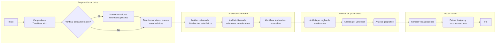

# Productos_Falsos
Explorar en profundidad un dataset específico para extraer insights clave que puedan mejorar la detección de productos falsificados en un marketplace.

# CASO PRÁCTICO

## Estructura del proyecto

```bash
├── 1. Descripción del Proyecto
│   ├── 1.1-Objetivos del Proyecto
│   ├── 1.2-Aspectos a Considerar
│   ├── 1.3-Preguntas Clave
├── 2. Importación de Librerías
├── 3. Carga de Datos
│   ├── 3.1-Definir Ruta de la Carpeta Base
│   ├── 3.2-Listar Archivos en la Carpeta
├── 4. Ingeniería de Características
│   ├── 4.1-Estructura de los Datos
│   │   ├── 4.1.1-Identificación de Columnas y Fuentes
│   ├── 4.2-Perfilamiento de los Datos
│   │   ├── 4.2.1-Muestra Aleatoria y Transposición
│   ├── 4.3-Tipos de Datos
│   ├── 4.4-Identificación de Datos Nulos
│   ├── 4.5-Visualización de Variables Categóricas
│   ├── 4.6-Reemplazo de la Variable 'Rule'
├── 5. Análisis Exploratorio de Datos (EDA)
│   ├── 5.1-Análisis de Variables Numéricas Clave
│   │   ├── 5.1.1-Histogramas
│   │   ├── 5.1.2-Diagramas de Caja
│   ├── 5.2-Cálculo y Análisis de Productos Moderados vs. No Moderados
│   ├── 5.3-Exploración de 'Dominio_normalizado' y 'Marca'
│   │   ├── 5.3.1-Tasas de Moderación por 'site_id'
│   │   ├── 5.3.2-Tasas de Moderación por 'Dominio_normalizado'
│   │   ├── 5.3.3-Tasas de Moderación por 'Marca'
│   ├── 5.4-Análisis Detallado de Categorías y Marcas Principales
│   ├── 5.5-Distribución de 'Score' por Grupos
│   │   ├── 5.5.1-Productos Moderados vs. No Moderados
│   │   ├── 5.5.2-Productos Falsos vs. No Falsos
├── 6. Conclusiones y Estrategias
│   ├── 6.1-Hallazgos Clave
│   ├── 6.2-Distribución y Patrones
│   ├── 6.3-Oportunidades y Hallazgos Inesperados
│   ├── 6.4-Estrategias para Mejorar la Detección
│   ├── 6.5-Impacto en el Marketplace
│   ├── 6.6-Prevención y Soluciones
```

**Aspectos a Considerar:**

1. Descripción y Estructura del Dataset:

* Familiarse con los atributos del dataset.
*  la relevancia de cada atributo en la detección de falsificaciones.

2. Distribución y Patrones:

* Identifica tendencias generales en los datos.
* Detecta anomalías o concentraciones inusuales que puedan indicar falsificaciones.

3. Relaciones y Correlaciones:

* Explora las conexiones entre diferentes factores.
* Determina qué características podrían ser indicativas de productos falsificados.

4. Análisis Adicional:

* Piensa fuera de la caja: el dataset puede ofrecer oportunidades para proponer estrategias innovadoras.
* Busca hallazgos inesperados que puedan surgir del análisis.
* Propón estrategias adicionales que podrían mejorar la detección de falsificaciones.

5. Presentación de Resultados:

* Presenta tus resultados de forma clara y concisa.
* Resalta tendencias clave y oportunidades de mejora.
* Identifica áreas que merecen mayor investigación.

**Preguntas Clave:**

Impacto en el Marketplace:

* ¿Por qué es esencial identificar y eliminar productos falsificados?
* ¿Cómo afecta esto a los compradores, vendedores y a la plataforma en general?

Estrategias de Detección:

* Si pudieras diseñar nuevas formas de identificar productos falsificados
* ¿qué tácticas o fuentes de información considerarías?

Evasión de Reglas por Parte de Vendedores:

* ¿Cómo crees que algunos vendedores podrían intentar evadir las reglas para seguir operando?
* ¿Qué soluciones propondrías para adelantarnos a esas tácticas?


### 1. Caso de estudio

1. ¿Qué estoy tratando de lograr?

**Objetivo general:**

Explorar en profundidad un dataset específico para extraer insights clave que puedan mejorar la detección de productos falsificados en un marketplace.

**Impacto esperado:**

1. Mejorar la experiencia y confianza del cliente.
2. Proteger la reputación de la plataforma.
3. Promover una competencia justa entre vendedores legítimos.

**Métrica de éxito:**

1. Incremento en la precisión de la detección de productos falsificados.
2. Reducción del tiempo promedio para identificar y actuar sobre productos sospechosos.
3. Disminución de quejas de compradores relacionadas con productos falsificados.


2. ¿Cuáles son las entradas y salidas del proceso de ciencia de datos?

**Entradas:**

Dataset: Información detallada de los productos.

| Campo                | Descripción                                                                 |
|----------------------|-----------------------------------------------------------------------------|
| 1. element_id        | Id de producto                                                              |
| 2. site_id           | País                                                                        |
| 3. seller_id         | Id del vendedor                                                             |
| 4. Dominio_normalizado | Categoría del producto                                                     |
| 5. Titulo            | Título del producto                                                         |
| 6. Marca             | Marca publicada del producto                                                |
| 7. Precio            | Precio del producto                                                         |
| 8. Rule              | Regla con la que se moderó la publicación                                    |
| 9. Score             | Score del modelo de Machine Learning. Utilizado por la regla "FK_MODELO"    |
| 10. Moderado         | Flag que indica que el producto fue moderado por alguna regla               |
| 11. Fake             | Flag que indica que el producto es un producto falsificado. Taggeado de forma manual |
| 12. Rollback         | Flag que indica que luego de la moderación, la misma fue revertida por un operador de Atención al Cliente ante reclamo de usuario |
| 13. FK_TEST1         | Regla de test. Actualmente apagada. Si detecta que es Fake, FK_TEST1 = 1    |
| 14. FK_TEST2         | Regla de test. Actualmente apagada. Si detecta que es Fake, FK_TEST2 = 1    |


**Salidas:**

1. Modelo que pueda predecir si un producto es falsificado o legítimo con base en las características disponibles.

2. Reportes sobre patrones o características clave de los productos falsificados.

3. Alertas para que el equipo operativo tome medidas rápidas en los casos identificados como de alta probabilidad.


**Supuestos:**

1. Los datos proporcionados son representativos del problema y están suficientemente etiquetados.

2. Las características actuales (atributos del dataset) son suficientes para detectar falsificaciones.

3. Los productos falsificados presentan patrones distinguibles en comparación con los legítimos.


### 2. Explicación del proceso





✅ **1. Preparación de datos**

Lectura de los archivos Excel, carga de datos en DataFrames usando Pandas.


✅ **2. Ingeniería de características**

En este paso, se seleccionan aleatoriamente dos filas del DataFrame Data_cargada para obtener una primera aproximación a los datos. Esto permite identificar si alguna columna del DataFrame contiene un diccionario, facilitando así la revisión y el análisis inicial de la estructura de los datos.

En este caso, se identifican las siguientes variables y su significado, donde se encuentran datos categóricos y numéricos:


| Campo                | Descripción                                                                 |
|----------------------|-----------------------------------------------------------------------------|
| 1. element_id        | Id de producto                                                              |
| 2. site_id           | País                                                                        |
| 3. seller_id         | Id del vendedor                                                             |
| 4. Dominio_normalizado | Categoría del producto                                                     |
| 5. Titulo            | Título del producto                                                         |
| 6. Marca             | Marca publicada del producto                                                |
| 7. Precio            | Precio del producto                                                         |
| 8. Rule              | Regla con la que se moderó la publicación                                    |
| 9. Score             | Score del modelo de Machine Learning. Utilizado por la regla "FK_MODELO"    |
| 10. Moderado         | Flag que indica que el producto fue moderado por alguna regla               |
| 11. Fake             | Flag que indica que el producto es un producto falsificado. Taggeado de forma manual |
| 12. Rollback         | Flag que indica que luego de la moderación, la misma fue revertida por un operador de Atención al Cliente ante reclamo de usuario |
| 13. FK_TEST1         | Regla de test. Actualmente apagada. Si detecta que es Fake, FK_TEST1 = 1    |
| 14. FK_TEST2         | Regla de test. Actualmente apagada. Si detecta que es Fake, FK_TEST2 = 1    |


Al momento de identificar los datos nulos en el DataFrame, lo cual es un paso crucial en el preprocesamiento de datos. Los datos no contienen filas duplicadas y la única columna con valores faltantes es "Regla". Esta variable no se puede eliminar debido a su importancia, ya que representa la regla con la que se moderó la publicación. Por lo tanto, se propone reemplazar los datos en blanco con una etiqueta que diga "No Fue Aplicada la Regla".


✅ **3. Visualisación de la data**

En esta sección, se realiza un análisis exploratorio de las variables numéricas clave: 'Moderado', 'Fake', 'Rollback' , 'Precio' y 'Score'. El objetivo es comprender la distribución de estas variables y detectar posibles patrones o anomalías que puedan aportar información relevante para la detección de productos falsificados. Para ello, se utilizarán histogramas y diagramas de caja. A través de la combinación de estas técnicas de visualización, se espera obtener una visión clara de la distribución de las variables numéricas y extraer insights preliminares que guíen el análisis posterior.


**Moderado**

- Histograma: El histograma muestra una gran concentración de valores en 0 y una barra mucho más pequeña en 1, indica que la mayoría de los productos no han sido moderados y solo una pequeña proporción ha pasado por un proceso de moderación. Esto podría sugerir que el sistema de moderación actual es selectivo o que la prevalencia de productos problemáticos es baja.

- Diagrama de caja: En el diagrama de caja con la mediana cerca de 0 y pocos o ningún valor atípico refuerza la idea de que la moderación es poco frecuente. Si hubiera valores atípicos (outliers) en 1, estos podrían representar productos que han sido moderados repetidamente, lo que podría ser un indicio de comportamiento sospechoso o de productos problemáticos.

**Fake**

- Histograma: El histograma muestra una mayor concentración en 0 que en 1, indica que hay más productos genuinos que falsos en el conjunto de datos. La proporción entre las barras de 0 y 1 da una idea de la prevalencia de productos falsificados.

- Diagrama de caja: Dado que 'Fake' es una variable binaria, el diagrama de caja mostrará principalmente la mediana en 0 o 1, indicando si la mayoría de los productos son genuinos o falsos. No se esperan valores atípicos en este caso, ya que solo hay dos valores posibles.

**Rollback**

- Histograma: En el histograma se mira una concentración en 0 y una barra mucho más pequeña en 1 sugiere que la mayoría de las moderaciones no son revertidas (rollback). Esto indicaría que el sistema de moderación es generalmente preciso en sus decisiones.

- Diagrama de caja: Para el diagrama de caja como la mediana esta cerca de 0 y pocos o ningún valor atípico refuerza la idea de que las reversiones de moderación son poco frecuentes. Si hubiera valores atípicos (outliers) en 1, estos podrían representar productos con un número inusualmente alto de reversiones, lo que podría indicar problemas con la aplicación de las reglas de moderación.


**Precio**

- Histograma: El histograma muestra una distribución asimétrica positiva o sesgada a la derecha. Esto significa que la mayoría de los precios se concentran en valores bajos, con una "cola" larga que se extiende hacia la derecha, representando los precios más altos.

- Diagrama de caja: El box plot confirma la asimetría a la derecha de la distribución, ya que la mediana se encuentra más cerca del extremo inferior de la caja y hay una mayor cantidad de valores atípicos en el extremo superior.


✅ **4. Analsis detallado por varibles**


**Calcula el porcentaje de productos moderados y no moderados y analiza la distribución y relación entre las columnas 'Moderado' y 'Falso'**


**Porcentaje:**

- Porcentaje de productos moderados: Esto indica que solo el 10.60% de los productos en el conjunto de datos fueron moderados.

- Porcentaje de productos no moderados: La gran mayoría de los productos (89.40%) no fueron moderados.

**Distribución**

- La fila Moderado = 0 muestra la distribución de productos que no fueron moderados:
El 98.51% de los productos no moderados no eran falsos (Fake = 0).
Solo el 1.49% de los productos no moderados eran falsos (Fake = 1).

- La fila Moderado = 1 muestra la distribución de los productos que sí fueron moderados:
El 7.62% de los productos moderados no eran falsos (Fake = 0).
El 92.38% de los productos moderados eran falsos (Fake = 1).

Por otro lado, los productos etiquetados como "Fake", el 88.04% fueron moderados.


**Interpretación General:**

La gran mayoría de los productos moderados el  92.37% son productos que también están etiquetados como "Fake". Esto indica que el sistema de moderación está funcionando para identificar y tomar medidas sobre los productos falsos. La moderación podría ser más amplia, dado que el porcentaje total de productos moderados es bajo (10.60%), es posible que se encuentren productos falsos que no estén siendo moderados. Esto permite mejorar la cobertura y moderar más productos potencialmente problemáticos.


**Explorar la relación entre 'Dominio_normalizado' y 'Marca' para encontrar las categorías de productos y marcas más afectadas por las moderaciones y las falsificaciones**


### Parte 1:

La lista anterior muestra los 'seller_id' de los vendedores con una alta tasa de moderación. El valor asociado a cada seller_id representa la proporción de productos de ese vendedor que fueron moderados. Por ejemplo, el vendedor con seller_id 5508796 tuvo todos sus productos (1.000000 o 100%) moderados. Estos vendedores presentan un porcentaje significativamente alto de productos moderados, lo que podría indicar un comportamiento sospechoso o la publicación frecuente de productos que infringen las reglas. Se recomienda investigar más a fondo a estos vendedores para determinar si están involucrados en actividades fraudulentas o si necesitan ser contactados para revisar sus prácticas de publicación.

### Parte 2:

La segunda parte de la lista muestra las combinaciones de categorías de productos (Dominio_normalizado) y países (site_id) con una alta tasa de moderación. El valor asociado a cada combinación representa la proporción de productos de esa categoría y país que fueron moderados. Por ejemplo, todos los productos de la categoría "AUDIO_AND_VIDEO_CABLES_AND_ADAPTERS" publicados en Perú (site_id = PERU) fueron moderados (1.000000 o 100%). Algunas categorías de productos en ciertos países tienen una probabilidad mucho mayor de ser moderadas. Esto podría deberse a varios factores, como una mayor prevalencia de productos falsificados en esas categorías y países, o reglas de moderación más estrictas para ciertos tipos de productos en regiones específicas.


### Tasa de moderación para cada dominio o categoría de producto


La gráfica muestra una variación significativa en las tasas de moderación entre las diferentes categorías de productos. Algunas categorías tienen tasas de moderación muy bajas (cercanas al 0%), mientras que otras tienen tasas mucho más altas (superiores al 20% o incluso al 40%).

Categorías con altas tasas de moderación: Las categorías con las tasas de moderación más altas son:

- TV_REMOTE_CONTROLS
- AUDIO_AND_VIDEO_CABLES_AND_ADAPTERS
- DATA_CABLES_AND_ADAPTERS
- LAPTOP_CHARGERS
- CELL_PHONE_CHARGERS

Esto sugiere que estas categorías podrían ser más propensas a tener productos falsificados o que infringen las reglas de la plataforma, lo que lleva a una mayor necesidad de moderación. Muchas categorías tienen tasas de moderación muy bajas, lo que indica que la mayoría de los productos en esas categorías no requieren moderación.

La gráfica revela que la necesidad de moderación varía significativamente entre las categorías de productos. Las categorías con altas tasas de moderación deben ser objeto de mayor atención y escrutinio, ya que podrían ser más vulnerables a la presencia de productos falsificados o que infringen las reglas.


### Análisis detallado de las principales categorías de productos y marcas con las tasas de moderación más altas


1. Las categorías que presentan los mayores índices de moderación comparten ciertas características que podrían estar relacionadas con la frecuencia de falsificaciones y el comportamiento de los vendedores:

**TV_REMOTE_CONTROLS**

Tasa de moderación: 61.43%

Puntuación promedio: 0.722

Porcentaje de productos falsos: 10.0%

Precio promedio: 4,000.31

Observación: Esta categoría tiene la tasa más alta de moderación, lo que sugiere una mayor incidencia de incumplimientos, aunque el porcentaje de falsificaciones es relativamente bajo. Esto podría estar relacionado con descripciones incorrectas o falta de información en las publicaciones.

**AUDIO_AND_VIDEO_CABLES_AND_ADAPTERS**

Tasa de moderación: 31.25%

Puntuación promedio: 0.556

Porcentaje de productos falsos: 18.75%

Precio promedio: 10,914.74

Observación: La alta tasa de moderación y falsificaciones indica que esta categoría es problemática. Los precios relativamente altos podrían atraer a falsificadores o vendedores con prácticas no conformes.

**DATA_CABLES_AND_ADAPTERS**

Tasa de moderación: 22.96%

Puntuación promedio: 0.491

Porcentaje de productos falsos: 9.34%

Precio promedio: 26,522.07

Observación: Aunque el porcentaje de falsificaciones es más bajo que en la categoría anterior, los precios elevados podrían justificar una supervisión más estricta para evitar fraudes.

**MOBILE_DEVICE_CHARGERS**

Tasa de moderación: 17.37%

Puntuación promedio: 0.478

Porcentaje de productos falsos: 10.78%

Precio promedio: 35,001.75

Observación: Esta categoría presenta un precio promedio notablemente alto, lo que podría estar relacionado con la comercialización de productos premium o réplicas de marcas reconocidas.

**GAMEPADS_AND_JOYSTICKS**

Tasa de moderación: 15.69%

Puntuación promedio: 0.424

Porcentaje de productos falsos: 6.86%

Precio promedio: 56,219.24

Observación: Aunque el porcentaje de productos falsos es el más bajo entre las categorías principales, los precios altos y la tasa de moderación sugieren que esta categoría también necesita monitoreo.


2. Marcas con las tasas de moderación más altas
Todas las marcas con el 100% de moderación comparten la característica de ser "Segunda marca" o "Genérico", lo que indica una alta probabilidad de productos falsificados.

**Segunda marca Ray-Ban**

Puntuación promedio: 0.96

Porcentaje de productos falsos: 100.0%

Precio promedio: 187,945.00

Observación: Los productos bajo esta marca tienen precios elevados, lo que podría estar asociado con intentos de vender imitaciones de una marca premium.

**Simil HP**

Puntuación promedio: 0.939

Porcentaje de productos falsos: 100.0%

Precio promedio: 365,319.31

Observación: Los precios extremadamente altos refuerzan la hipótesis de que estos productos buscan imitar equipos originales de HP, pero no cumplen con los estándares requeridos.

**Segunda marca HP**

Puntuación promedio: 0.936

Porcentaje de productos falsos: 100.0%

Precio promedio: 315,178.84

Observación: Similar al caso anterior, esta marca presenta un comportamiento sospechoso relacionado con productos de alto valor que podrían ser réplicas.

**Segunda marca Intel**

Puntuación promedio: 0.983

Porcentaje de productos falsos: 100.0%

Precio promedio: 219,247.73

Observación: Dado que Intel es una marca reconocida, estos productos probablemente estén relacionados con la venta de procesadores o componentes no originales.

**Segunda marca JBL**

Puntuación promedio: 0.954

Porcentaje de productos falsos: 100.0%

Precio promedio: 12,054.52

Observación: En comparación con las otras marcas, los precios son más bajos, lo que podría estar vinculado a productos más accesibles que intentan imitar dispositivos de audio originales.


3. Categorías: Las categorías con alta moderación tienden a incluir productos con precios variados, pero la incidencia de falsificaciones parece estar influida por factores como la popularidad del producto y su demanda en el mercado. Es crucial reforzar los controles en estas categorías, especialmente en aquellas con mayores tasas de falsificaciones.

4. Marcas: Las marcas con tasas de moderación del 100% son todas no oficiales, lo que evidencia una tendencia clara hacia la comercialización de productos falsificados o de baja calidad bajo nombres genéricos o de imitación.


Con base en el análisis realizado hasta el momento, hemos identificado algunos patrones potenciales y valores atípicos relacionados con las moderaciones. Para explorar estos patrones con más detalle, podemos analizar la distribución de la puntuación para diferentes grupos de productos, como productos moderados frente a productos no moderados, y productos marcados como falsos frente a los que no lo están.


**Grafica 1**

La distribución de productos no moderados domina en casi todas las puntuaciones bajas, lo que es esperable ya que no todos los productos publicados son moderados. Por el contrario, la proporción de productos moderados se vuelve más significativa a partir de puntuaciones cercanas a 0.8, destacando una correlación positiva entre una puntuación alta y la probabilidad de ser moderado.


**Grafica 2**

La mayoría de los productos en este rango no son falsos, lo que indica que puntuaciones más bajas están correlacionadas con un menor riesgo de falsificación. Aquí se observa una tendencia opuesta, predominan los productos falsos, lo que sugiere que este rango está asociado con atributos que aumentan la probabilidad de que un producto sea una falsificación (por ejemplo, nombres de marca genéricos, precios inusuales o descripciones engañosas).


### Proporción de productos falsos por site_id y Dominio_normalizado


**1. Proporción por país (site_id):**

Los países Argentina, Brasil, México y Perú tienen la mayor proporción de productos falsificados, alcanzando valores similares y relativamente altos en comparación con otros países como Chile y Colombia, que presentan valores más bajos.

Esto sugiere que en estos países hay un mayor nivel de publicaciones de productos potencialmente falsificados.

**2. Dominio de productos falsificados:**

La proporción de productos falsificados está distribuida entre diversas categorías (diferenciadas por colores en la barra apilada). Algunas categorías como:

AUDIO_AND_VIDEO_CABLES_AND_ADAPTERS

DATA_CABLES_AND_ADAPTERS

MOBILE_DEVICE_CHARGERS

SUNGLASSES

SMARTWATCHES

Estas son recurrentes en varios países, lo que podría indicar que estas categorías tienen una mayor probabilidad de ser falsificadas. Sin embargo, el análisis muestra que no hay una sola categoría dominante, lo que indica una diversidad de productos afectados por falsificaciones en cada mercado.


**3. Comparación entre países:**

Argentina y México presentan una proporción más alta en términos absolutos de productos falsificados, lo que podría deberse a factores como:

Mayor volumen de publicaciones.

Mayor demanda en categorías específicas con alta probabilidad de falsificación.

Chile y Colombia tienen menos categorías con una proporción significativa de productos falsificados, lo que sugiere una incidencia menor de este fenómeno.


### Proporción de productos falsificados por Marca ay Dominio_normalizado


**Marcas con mayor proporción de falsificaciones:**

- "Genérico" destaca significativamente con una proporción extremadamente alta de productos falsificados, mucho mayor que cualquier otra marca. Esto sugiere que los productos sin una marca específica (o marcados como genéricos) son más propensos a ser clasificados como falsificados.

- Varias marcas etiquetadas como "Simil" (Simil HP, Simil JBL, etc.) y "Segunda Marca" (Segunda Marca Intel, Segunda Marca Ray-Ban, etc.) también tienen altos niveles de falsificación. Esto refuerza la idea de que las marcas que intentan imitar productos originales tienen mayor probabilidad de ser reportadas o clasificadas como falsas.

- Las marcas reconocidas y originales (como Apple, JBL, y Carolina Herrera) tienen proporciones significativamente menores de productos falsificados en comparación con marcas genéricas o imitadoras.

- Productos tecnológicos como cables, cargadores y de moda gafas de sol, perfumes son las categorías más afectadas. Estas categorías podrían ser el enfoque inicial de medidas de control.

### Visualisar la proporción de productos 'Falsos' dentro de diferentes categorías de 'site_id', 'Dominio_normalizado', 'Marca' y 'Regla'


### Distribución de 'Rollback' por 'Regla' para comprender qué reglas de moderación son propensas a ser revocadas.


Alta incidencia en FK_PRICE: Los datos sugieren que los precios son una fuente importante de problemas en los productos moderados. Esto puede estar relacionado con errores en la entrada manual de datos, políticas de precios inconsistentes, o intentos deliberados de manipulación.

Atributos como foco secundario: La regla FK_ATTRIBUTE también destaca como un área que requiere atención, posiblemente por discrepancias en los atributos de los productos (como nombres de marcas, especificaciones técnicas, etc.).

Modelo y otras reglas estables: Las reversiones para la regla FK_MODEL y casos donde las reglas no fueron aplicadas son inexistentes, lo cual es positivo, ya que indica estabilidad en estas áreas.

### Calcular la correlación entre 'Precio', 'Score' y 'Moderado' para identificar patrones potenciales en los precios de productos moderados.


Relación entre Precio y otras variables: El precio no tiene una correlación fuerte ni con el score ni con la moderación, lo que sugiere que no es un factor relevante en estas áreas.

Importancia del Score en la Moderación: La moderación tiene una correlación significativa con el score, lo que resalta que los productos revisados o validados tienden a ser percibidos como mejores o más confiables.

### Identificamos las reglas que son particularmente efectivas o ineficaces para identificar productos falsificados


**Reglas que son especialmente eficaces para identificar falsificaciones:**

- FK_MODEL: Esta regla tiene la mayor proporción de productos “falsos”, lo que sugiere que es muy eficaz para detectar falsificaciones.
- FK_ATTRIBUTE: Esta regla tiene una alta proporción de productos “falsos”, lo que sugiere que también es eficaz para identificar falsificaciones.
- FK_PRICE: Esta regla tiene una proporción moderada de productos “falsos”, pero también tiene una alta proporción de reversiones, lo que indica que podría revocarse con frecuencia.


**Posibles palabras clave o patrones de títulos que podrían ser indicadores de productos falsificados:**

- Palabras como 'imitacion', 'oem', 'calidad', 'premium!', podrían indicar productos falsificados.
- Ciertas marcas como 'Casio', 'JBL', and 'Samsung' aparecer con frecuencia en los títulos de productos falsos.
- La presencia de especificaciones del producto como por ejemplo 'RAM', 'GB', 'SSD', 'ML' ambién podría ser un indicio de falsificaciones.


✅ **Conclusiones del Análisis Exploratorio**


**1. Hallazgos Clave**

Alta Moderación de Productos Falsos: El 88.04% de los productos identificados como "Falsos" fueron moderados, reflejando un sistema eficiente en la detección de irregularidades.

Tendencias Regionales: Perú presenta una tasa de moderación superior al promedio, indicando una mayor incidencia de productos falsificados en comparación con otros países.

Categorías Vulnerables: Las categorías con mayor susceptibilidad a falsificaciones incluyen:

Controles Remotos de TV.

Cables y Adaptadores de Audio y Video.

Cables y Adaptadores de Datos.

Marcas Sospechosas: Términos como “Segunda Marca” o “Simil” en los nombres de marca tienen una tasa de moderación del 100%, siendo indicadores clave de falsificaciones.

Vendedores de Alto Riesgo: Algunos vendedores tienen tasas de moderación superiores al 50%, sugiriendo un potencial involucramiento en actividades fraudulentas.

Correlaciones Importantes:

Productos con mayor "Score" tienen mayor probabilidad de ser falsos.

Productos de menor precio están más asociados con falsificaciones.

Combinaciones específicas de país y categoría presentan patrones elevados de falsificaciones.

**2. Distribución y Patrones**

Tendencias:

Alta coincidencia entre productos marcados como "Falsos" y su posterior moderación.

Mayor incidencia de falsificaciones en Perú.

Categorías específicas destacan por su alta vulnerabilidad.

Anomalías:

Marcas con términos genéricos o ambiguos tienen tasas de moderación extremadamente altas.

Algunos vendedores concentran actividades sospechosas.

Concentraciones Inusuales:

Patrones regionales en ciertas categorías y países, como Perú, con mayores tasas de falsificaciones.

**3. Oportunidades y Hallazgos Inesperados**

Patrones Regionales: La concentración de productos falsificados en Perú sugiere la necesidad de estrategias regionalizadas.

Detección por Palabras Clave: Términos específicos en nombres de marca podrían ser un método rápido para identificar falsificaciones.

Auditorías: Los vendedores con altas tasas de moderación justifican revisiones proactivas para mitigar actividades fraudulentas.

Modelos Predictivos: Existe potencial para desarrollar modelos de machine learning con variables como "Score", precio, categoría y región para mejorar la detección de falsificaciones.

**4. Estrategias para Mejorar la Detección**

Personalización Regional:

Implementar medidas específicas para países con alta incidencia, como Perú.

Realizar campañas educativas y reforzar la regulación local.

Procesamiento del Lenguaje Natural (PLN):

Usar técnicas como BERT para identificar patrones en descripciones sospechosas.

Sistema de Alertas:

Priorizar moderación en productos con altos "Scores" o palabras clave sospechosas.

Auditorías de Vendedores:

Revisar frecuentemente a vendedores con altas tasas de moderación.

Visión Computacional:

Detectar diferencias visuales entre productos auténticos y falsificados mediante análisis de imágenes.

**5. Impacto en el Marketplace**

Compradores:

La confianza y experiencia del cliente disminuyen con productos falsificados.

Riesgo de seguridad al adquirir productos no genuinos.

Vendedores Legítimos:

Competencia desleal por precios más bajos de productos falsos.

Impacto negativo en la reputación de sus productos genuinos.

Plataforma:

Pérdida de ingresos por disminución de clientes y vendedores legítimos.

Riesgos legales por facilitar la venta de falsificaciones.

Deterioro de la reputación del marketplace.

**6. Prevención y Soluciones**

- Tácticas de Evasión:

Utilizar descripciones ambiguas o engañosas para evitar la detección por palabras clave.

Publicar productos en categorías incorrectas para evitar reglas específicas de cada categoría.

Crear múltiples cuentas para eludir las restricciones impuestas a un vendedor individual.

Solicitar a compradores cómplices que dejen reseñas positivas falsas.

- Soluciones Proactivas:

Implementar sistemas de detección de patrones de comportamiento sospechoso.

Utilizar técnicas de aprendizaje automático para identificar descripciones y títulos engañosos.

Establecer límites en la cantidad de productos que nuevos vendedores pueden publicar.

Analizar las redes de conexión entre vendedores para identificar y desmantelar operaciones fraudulentas.

**7. Estrategias de Detección**

Análisis de Imágenes: Utilizar visión artificial para analizar las imágenes de los productos e identificar diferencias sutiles entre productos originales y falsificados.

Análisis de Redes: Identificar conexiones entre vendedores de falsificaciones para desmantelar redes de operación.

Colaboración con Marcas: Establecer un programa de verificación y autenticación de productos en colaboración con las marcas.

Información Externa: Incorporar información de otras fuentes, como bases de datos de productos falsificados o listas de vendedores sospechosos.

Inteligencia Artificial Generativa: Desarrollar un sistema de inteligencia artificial generativa (como un LLM) que sea capaz de analizar las descripciones de los productos y puntuar su probabilidad de autenticidad, basándose en el contexto de las marcas.
